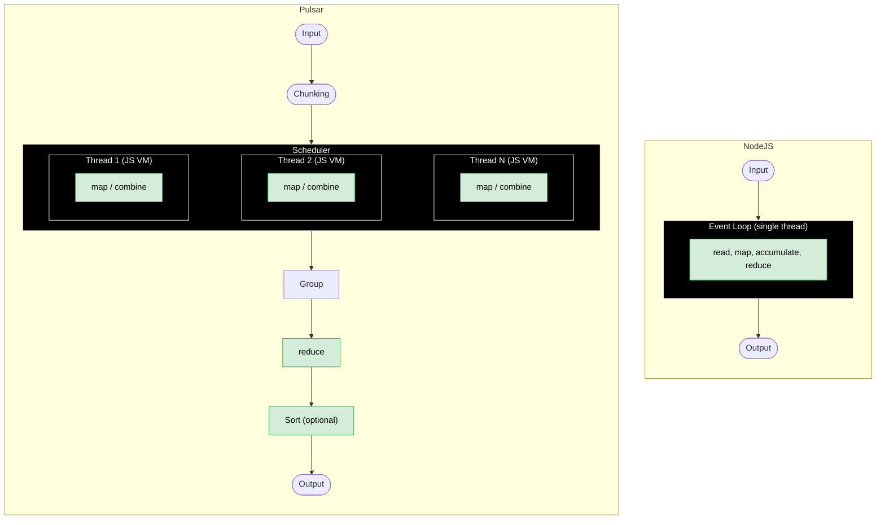

# pulsar

`pulsar` is a high-performance MapReduce engine for processing large datasets using user-defined JavaScript functions. It follows the standard Unix philosophy, reads from stdin or a file, writes to stdout, and composes naturally with other tools via pipes.

Features include ES2023 JavaScript support via [Amazon AWS's LLRT](https://github.com/awslabs/llrt) engine based on [QuickJS](https://bellard.org/quickjs/), work-stealing scheduler, streaming input/output, automatically spills to disk if intermediate data is too large, NDJSON output, sorting and an embedded test runner.

Define `map`, `combine`, `reduce`, `sort`, and `test` as async functions in your script. The engine handles parallelism, chunking, grouping, and orchestration. In the diagrams below, lighter sections represent your script and darker sections represent the engine:



On CPU-bound parallelizable workloads, `pulsar` is upwards of 47x faster than Node.js, see [perf](#performance) section. By default, if no script is provided, it performs a simple word count. See [`default_script.js`](./default_script.js) for an example implementation.

## Compilation

Requires Rust, nvm, NodeJS.

```bash
./build_llrt.sh
cargo install --path=.
```

## Usage

```bash
pulsar -f input_file -s script_file
pulsar -h
```

## Examples

<details>
<summary>Open list of examples</summary>

### Word Count (Default)

Counting the words in a text file:

```bash
# download Moby Dick from Gutenberg
$ wget https://www.gutenberg.org/files/2701/2701-0.txt -O input.txt
$ wc -l input.txt
21940

$ cat input.txt | pulsar
...
bluish: 2
pedlar: 1
magazine: 2
reckless: 5
```

You could provide a script to ignore stop words and sort the results:

<details>
<summary>script.js</summary>

```js
const STOP_WORDS = new Set([
  "a", "an", "and", "are", "as", "at", "be", "but", "by", "for", "if", "in",
  "into", "is", "it", "no", "not", "of", "on", "or", "such", "that", "the",
  "their", "then", "there", "these", "they", "this", "to", "was", "will", "with"
]);

const map = async (line) =>
  line
    .toLowerCase()
    .replace(/[^\p{L}\p{N}]+/gu, " ")
    .trim()
    .split(/\s+/)
    .filter(
      (word) => word && !STOP_WORDS.has(word) && !/\d/.test(word) // filter out any word containing digits
    )
    .map((word) => [word, 1]);

const reduce = async (key, values) => values.length;

const sort = async (results) =>
  results.sort((a, b) => a[0].localeCompare(b[0])); // Sort alphabetically
```

</details>

```bash
$ pulsar -f input.txt -s script.js --sort | head -n5
aback: 2
abaft: 2
abandon: 3
abandoned: 7
abandonedly: 1
```

### Log Analysis

Summarize web server logs to count logs per status codes:

<details>
<summary>script.js</summary>

```js
const map = async (line) => {
  // Parse Apache/Nginx log line example:
  // 127.0.0.1 - - [01/Jan/2023:00:00:01 +0000] "GET /path HTTP/1.1" 200 1234
  // Extract the HTTP status code (e.g. 200)
  const match = line.match(/"\w+ \S+ \S+" (\d{3}) \d+/);
  if (match?.[1]) {
    const status = match[1];
    return [[status, 1]];
  }
  return [];
};

const reduce = async (key, values) =>
  values.reduce((sum, count) => sum + count, 0);
```

</details>

```bash
docker run --rm mingrammer/flog -n 1000 >> /tmp/access.log
$ pulsar -f /tmp/access.log -s script.js
501: 47
416: 50
404: 43
204: 50
```

You could build on this to aggregate local vs internet IPs, then print the results in json:

<details>
<summary>script.js</summary>

```js
const isLocal = (ip) => {
  const [a, b] = ip.split(".").map(Number);
  return (
    a === 10 ||
    (a === 172 && b >= 16 && b <= 31) ||
    (a === 192 && b === 168) ||
    a === 127
  );
};

const map = async (line) =>
  [...line.matchAll(/\b(\d{1,3}(?:\.\d{1,3}){3})\b/g)].map((m) => {
    const ip = m[1];
    const type = isLocal(ip) ? "local" : "internet";
    return [type, ip];
  });

const reduce = async (key, values) => Array.from(new Set(values)); // deduplicate IPs
```

</details>

```bash
$ pulsar -f /tmp/access.log -s script.js --output=json | jq
{
  "local": [
    "172.22.38.139",
    "127.45.14.34",
  ]
}
{
  "internet": [
    "237.253.60.152",
  ]
}
```

If you want to go further, we can turn this into a simple network server:

```bash
$ socat TCP-LISTEN:1234,reuseaddr,fork EXEC:"pulsar -s script.js --output=json" &
$ echo "138.97.172.41 - - [26/Jul/2025:17:27:15 +0000] "PATCH /matrix/morph HTTP/1.0" 401 9375" | socat - TCP:localhost:1234
{"internet":["138.97.172.41"]}
$ killall socat
```

Not very efficient, but you get the idea.

</details>

## Performance

<details>
<summary>perf.txt</summary>

```txt

NodeJS version: v25.7.0
Pulsar version: 0.1.0-a97f384
CPU: AMD Ryzen 9 9950X3D 16-Core Processor 32

Summary

This benchmark performs a simple word count aggregation on a 20,000-line
copy of the Moby Dick by Herman Melville.

Each line is processed by the map function, which introduces an artificial
delay with jitter (0.05-0.45 ms per line, uniform random) to simulate
variable processing times of a real workload.

It compares Pulsar against a NodeJS equivalent implementation. Both
versions are asynchronous but, due to the nature of NodeJS, it runs on a
single thread. Remember, concurrency is not parallelism.

Pulsar, on the other hand, is a highly parallel MapReduce engine and can
leverage multiple threads and multiple execution contexts.

    Finished `release` profile [optimized] target(s) in 0.07s
Benchmark 1: pulsar-20k-lines
  Time (mean ± σ):     117.3 ms ±   4.4 ms    [User: 684.8 ms, System: 39.4 ms]
  Range (min … max):   113.5 ms … 124.8 ms    5 runs
 
Benchmark 2: pulsar-20k-lines-sort-by-key-asc
  Time (mean ± σ):     153.5 ms ±   3.5 ms    [User: 747.3 ms, System: 50.3 ms]
  Range (min … max):   149.1 ms … 156.4 ms    5 runs
 
Benchmark 3: baseline-node-20k-lines
  Time (mean ± σ):      5.584 s ±  0.013 s    [User: 5.185 s, System: 0.453 s]
  Range (min … max):    5.575 s …  5.607 s    5 runs
 
Summary
  pulsar-20k-lines ran
    1.31 ± 0.06 times faster than pulsar-20k-lines-sort-by-key-asc
   47.62 ± 1.79 times faster than baseline-node-20k-lines
Benchmark 1 (43 runs): ./target/release/pulsar -f input.txt -s pulsar-script.js
  measurement          mean ± σ            min … max           outliers         delta
  wall_time           117ms ± 5.34ms     104ms …  125ms          0 ( 0%)        0%
  peak_rss            307MB ± 3.16MB     303MB …  316MB          0 ( 0%)        0%
  cpu_cycles         3.59G  ± 56.7M     3.52G  … 3.83G           2 ( 5%)        0%
  instructions       11.1G  ± 46.0M     11.0G  … 11.3G           4 ( 9%)        0%
  cache_references    164M  ± 6.01M      154M  …  174M           0 ( 0%)        0%
  cache_misses       10.6M  ±  169K     10.3M  … 11.0M           0 ( 0%)        0%
  branch_misses      7.78M  ± 67.4K     7.67M  … 7.95M           0 ( 0%)        0%
Benchmark 2 (33 runs): ./target/release/pulsar -f input.txt -s pulsar-script.js --sort
  measurement          mean ± σ            min … max           outliers         delta
  wall_time           153ms ± 4.54ms     142ms …  161ms          0 ( 0%)        💩+ 30.8% ±  2.0%
  peak_rss            323MB ± 4.05MB     314MB …  329MB          0 ( 0%)        💩+  5.2% ±  0.5%
  cpu_cycles         3.97G  ±  137M     3.68G  … 4.26G           0 ( 0%)        💩+ 10.7% ±  1.3%
  instructions       11.9G  ±  112M     11.7G  … 12.2G           0 ( 0%)        💩+  7.6% ±  0.3%
  cache_references    166M  ± 5.01M      155M  …  173M           8 (24%)          +  1.3% ±  1.6%
  cache_misses       11.2M  ±  686K     10.3M  … 12.4M           0 ( 0%)        💩+  6.2% ±  2.0%
  branch_misses      8.50M  ±  487K     8.14M  … 10.9M           2 ( 6%)        💩+  9.2% ±  1.9%
Benchmark 3 (3 runs): node node-script.js input.txt
  measurement          mean ± σ            min … max           outliers         delta
  wall_time          5.58s  ± 41.7ms    5.53s  … 5.61s           0 ( 0%)        💩+4685.7% ± 10.7%
  peak_rss           81.3MB ± 87.6KB    81.2MB … 81.4MB          0 ( 0%)        ⚡- 73.5% ±  1.2%
  cpu_cycles         27.3G  ±  246M     27.1G  … 27.6G           0 ( 0%)        💩+661.6% ±  2.6%
  instructions       86.3G  ± 2.65G     83.3G  … 88.4G           0 ( 0%)        💩+678.9% ±  6.2%
  cache_references   7.11G  ±  142M     6.98G  … 7.26G           0 ( 0%)        💩+4234.1% ± 22.6%
  cache_misses       16.7M  ± 2.07M     14.5M  … 18.6M           0 ( 0%)        💩+ 58.3% ±  5.4%
  branch_misses      16.0M  ±  296K     15.7M  … 16.2M           0 ( 0%)        💩+105.6% ±  1.4%
```

</details>

## Tests

Each script can define a `async function test()` that will be executed when running the `pulsar` command with the `--test` flag.

For pulsar itself, there is an integration test suite that you can run with [bats](https://github.com/bats-core/bats-core):

```bash
bats tests
```
